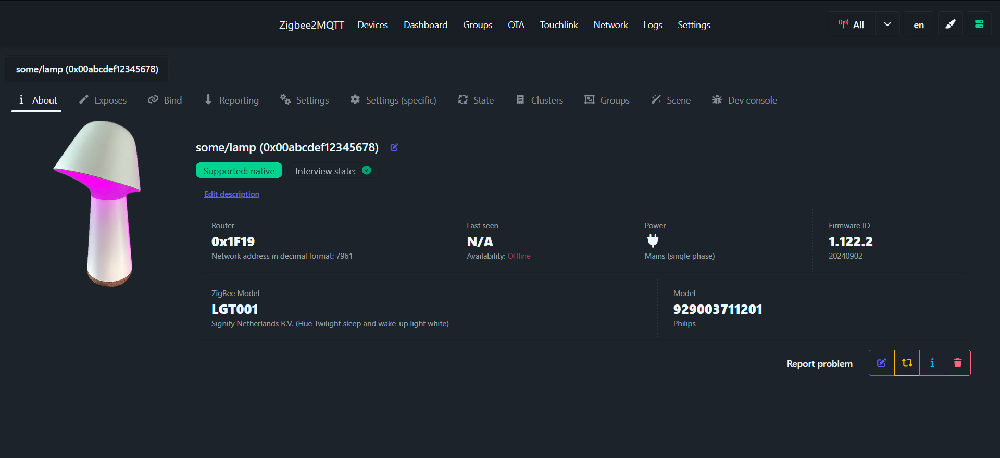
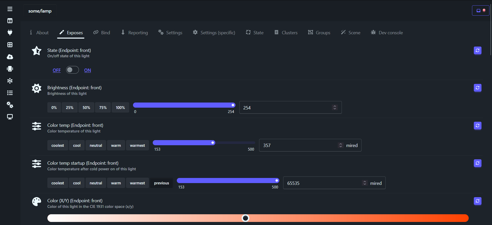
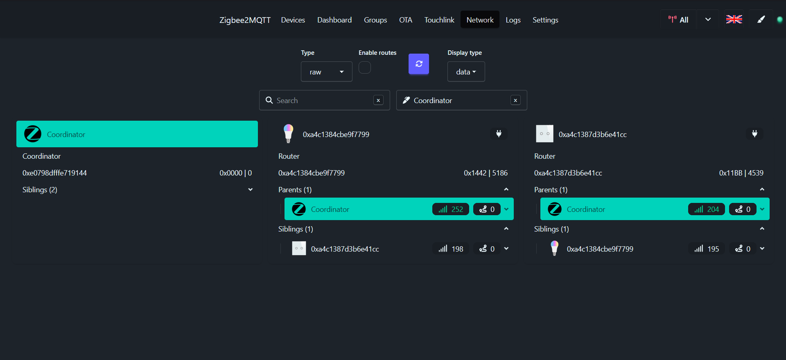
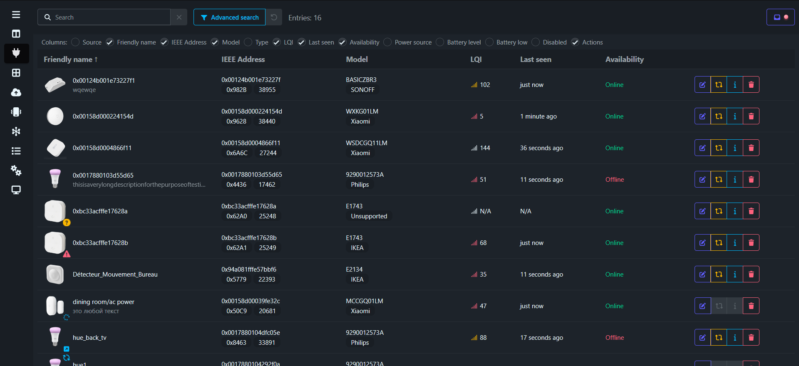
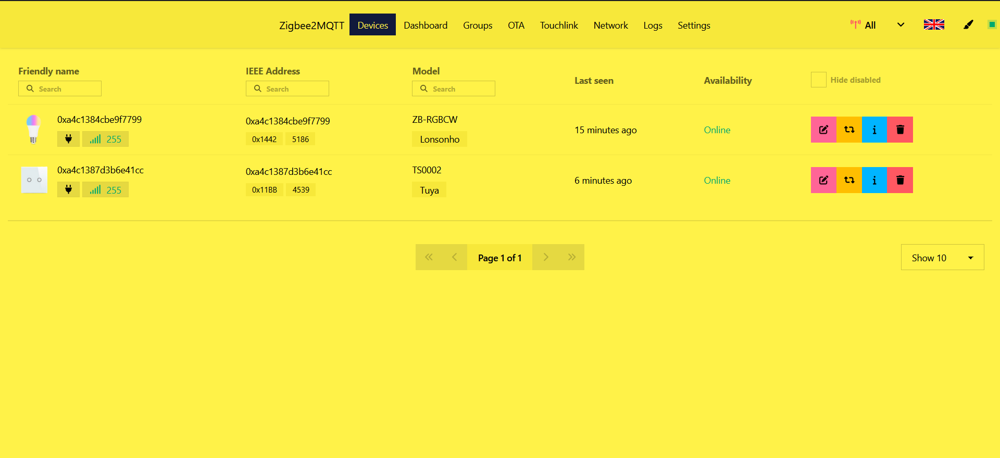
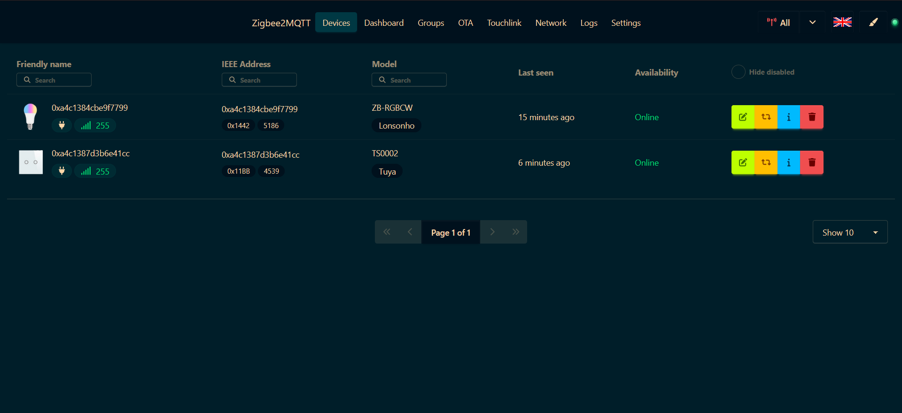
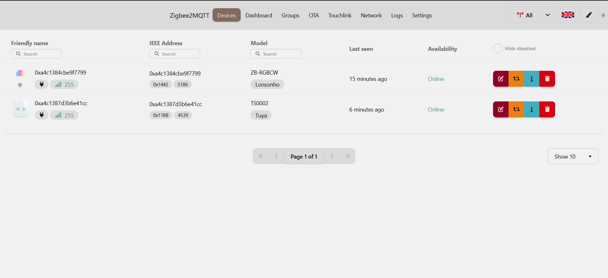

# Zigbee2MQTT WindFront

A frontend UI for [Zigbee2MQTT](https://github.com/Koenkk/zigbee2mqtt) using [tailwindcss](https://tailwindcss.com/) & [daisyui](https://daisyui.com).

https://github.com/Nerivec/zigbee2mqtt-windfront/wiki

> Based on https://github.com/nurikk/zigbee2mqtt-frontend

> [!IMPORTANT]
> Currently in beta test!

### 35 themes offered by the [design library](https://daisyui.com/docs/themes/#list-of-themes)!

# Contributing

[CONTRIBUTING](./CONTRIBUTING.md)
